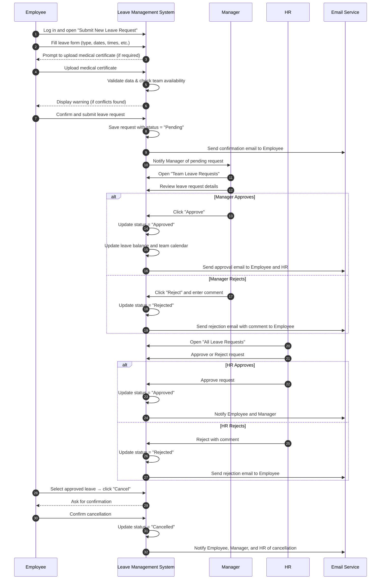
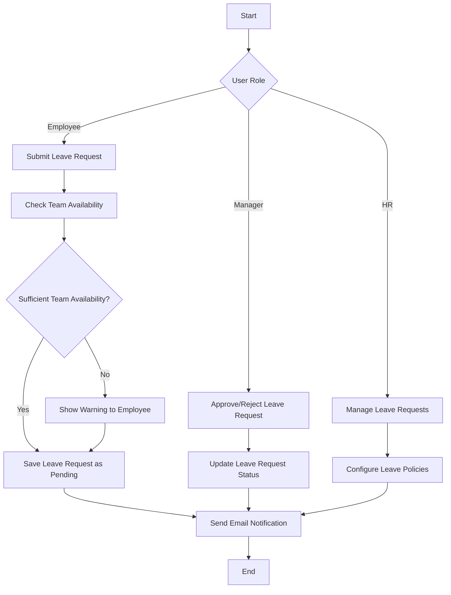
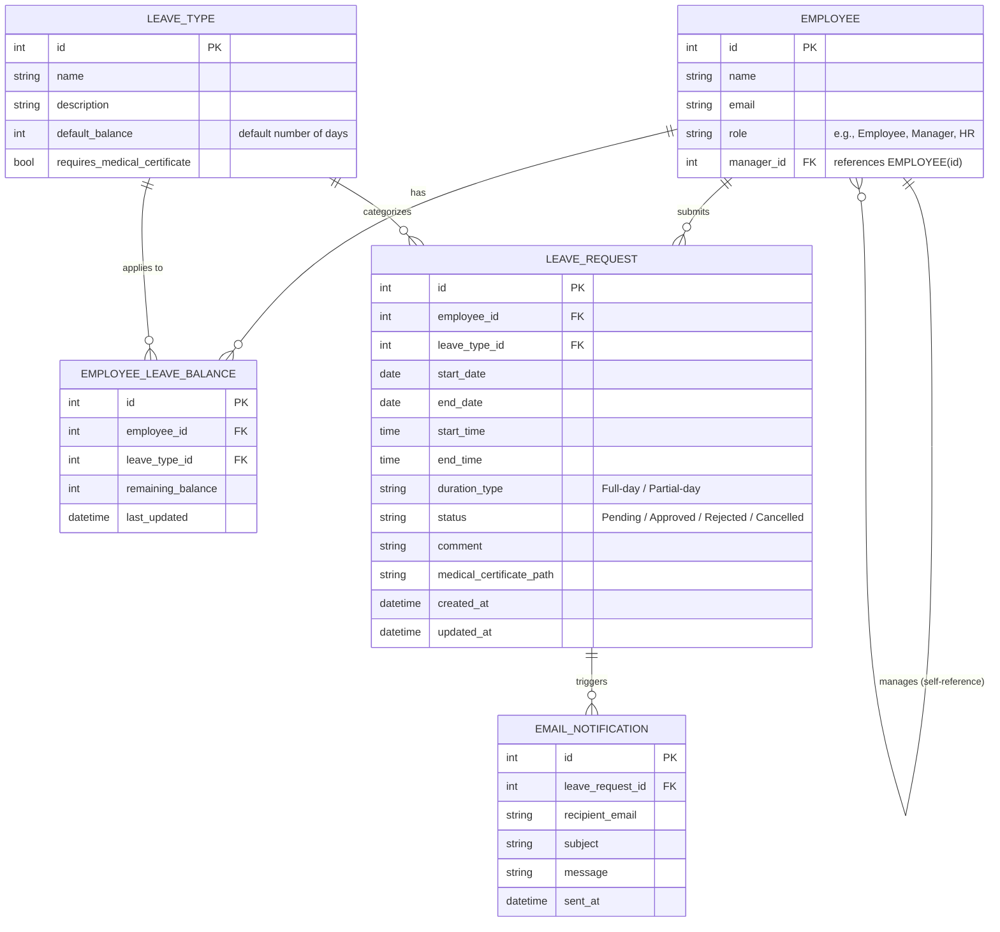

# Vacation Tracking System (VTS)

## 1. Introduction & Vision

The Vacation Tracking System (VTS) is a web application that aims to to help HRs manage employee leave requests and approvals efficiently.

## 2. Functional Requirements

### 2.1. Authentication and Authorization

#### 2.1.1 User Roles

- HR: Can view, approve, or reject leave requests.
- Manager: Can approve or reject leave requests from their team members. In addition, they can view team leave calendars.
- Employee: Can submit leave requests and view their leave balance and history.
- Admin: Can manage logs and system settings.

#### 2.1.2 Login

- Users can login using SSO (Single Sign-On) with their corporate credentials.

### 2.2. Leave Request Management

#### 2.2.1. Employee

- Employees can submit leave requests specifying the type of leave.
- Types of leaves available: Annual leave, Sick leave, Maternity/Paternity leave, Unpaid leave, Time comp off.
- Each type of leave has a predefined maximum limit per year (e.g., Annual leave: 20 days, Sick leave: 10 days).
- Some types of leave (e.g., Sick leave) need to be supported with a document upload feature (e.g., medical certificate).
- Leaves can be full-day or partial-day. If partial-day, employees can specify the start and end time.
- Employees can view the status of their leave requests (Pending, Approved, Rejected).
- Employees can cancel pending and approved leave requests.
- Employees can view their leave balance and history for each type of leave.
- Employees receive email notifications when their leave requests are approved or rejected.
- Employees get team availability information when submitting leave requests to avoid cases where multiple team members are on leave simultaneously. For example, if team of 5 members already has 3 members on leave for the requested dates, the system will show a warning to the employee before submitting the request. At least 2 team members should be available on any given day.
- Employees can view a calendar that displays their approved leaves and team members' approved leaves.

#### 2.2.2. Manager

- Managers have all the functionalities of an Employee.
- Managers can view leave requests from their team members.
- Managers can approve or reject leave requests. In addition, they can add comments when approving or rejecting leave requests.
- Managers can award additional leave hours to employees as a reward for overtime work or exceptional performance.

#### 2.2.3. HR

- HR can view all leave requests across the organization.
- HR can filter leave requests based on status, employee, department, and date range.
- HR can approve or reject leave requests, with the ability to add comments.
- HR can configure leave policies, including setting maximum leave limits.

## 2.3. Reporting and Analytics

- HR can generate reports on leave statistics, such as total leaves taken per department, average leave duration, and leave trends over time.
- HR can export leave data in CSV or PDF format.

## 3. Non-Functional Requirements

## 4. Constraints

- The system is an extension of the existing company system and must integrate with the existing user database for authentication. It should utilize the existing SSO mechanism for login.

## 5. Assumptions

- The existing user database is reliable and up-to-date.
- The company has a defined leave policy that can be configured in the system. HR will provide the necessary details for leave types and limits.
- The manager has to approve the leave first, then HR can approve/reject it.
- There is only one manager per employee, and the manager information is available in the user database.
- Team availability should be considered among direct team members reporting to the same manager for leave request warnings.

## 6. Use Cases

### 6.1. Time Management

#### 6.1.1. Employee submits/edits/cancels a leave request

**Use Case Name:** Employee submits a leave request
**Preconditions:** Employee is logged in and has sufficient leave balance.

1. Employee navigates to the "Leave Requests, and selects "Submit New Leave Request".
2. Employee fills in the leave request form, selecting the type of leave from a dropdown menu.
3. Employee selects sick leave.
4. The system prompts the employee to upload a medical certificate, by showing a file upload field.
5. Employee uploads the medical certificate.
6. Employee specifies whether the leave is full-day or partial-day by toggling a full-day/partial-day option.
7. Employee selects partial-day.
8. The system displays start and end time fields.
9. Employee fills in the start and end time for the partial-day leave.
10. Employee selects the start and end dates for the leave.
11. The system checks team availability for the selected dates.
12. The system displays a warning that 3 out of 5 team members are already on leave for the selected dates.
13. Employee confirms the warning and submits the leave request.
14. The system saves the leave request with a "Pending" status and sends an email notification to the employee confirming the submission.

---
**Use Case Name:** Employee edits a leave request
**Preconditions:** Employee is logged in and has a pending leave request.

1. Employee navigates to "My Leave Requests" and selects a pending leave request to edit.
2. Employee modifies the leave details to change the end date by extending it by 2 days.
3. The system checks team availability for the new dates.
4. The system displays a warning that 4 out of 5 team members will be on leave for the new dates.
5. Employee confirms the warning and submits the updated leave request.
6. The system updates the leave request and sends an email notification to the employee confirming the changes.

---
**Use Case Name:** Employee cancels a leave request
**Preconditions:** Employee is logged in and has an approved leave request.

1. Employee navigates to "My Leave Requests" and selects an approved leave request to cancel.
2. Employee clicks on the "Cancel Leave Request" button.
3. The system prompts the employee to confirm the cancellation.
4. Employee clicks on "Confirm" to proceed with the cancellation.
5. The system updates the leave request status to "Cancelled" and sends an email notification to the employee, manager, and HR confirming the cancellation.

---

#### 6.1.2. Manager approves/rejects a leave request

**Use Case Name:** Manager approves a leave request
**Preconditions:** Manager is logged in and has pending leave requests from team members.

1. Manager navigates to "Team Leave Requests" and selects a pending leave request from an employee.
2. Manager reviews the leave request details.
3. Manager clicks on the "Approve" button.
4. The system updates the leave request status to "Approved" and sends an email notification to the employee confirming the approval.
5. The email also notifies HR about the approved leave request.
6. The system updates the team calendar to reflect the approved leave. In addition, the system updates the employee's leave balance accordingly.

---

#### 6.1.3. HR approves/rejects a leave request

**Use Case Name:** HR rejects a leave request
**Preconditions:** HR is logged in and has pending leave requests.

1. HR navigates to "All Leave Requests" and selects a pending leave request.
2. HR reviews the leave request details.
3. HR clicks on the "Reject" button and adds a comment explaining the reason for rejection.
4. The system updates the leave request status to "Rejected" and sends an email notification to the employee with the rejection reason.

### 6.2. Sequence Diagram



### 6.3. Flowchart



## 7. Data Model



## 8. Pseudo Code

```text

FUNCTION submitLeaveRequest(employeeId, leaveTypeId, startDate, endDate, durationType, medicalCertificate):
    IF NOT hasSufficientLeaveBalance(employeeId, leaveTypeId, startDate, endDate):
        RETURN "Insufficient leave balance"

    teamAvailability = checkTeamAvailability(employeeId, startDate, endDate)
    IF teamAvailability < MIN_REQUIRED_TEAM_MEMBERS:
        SHOW_WARNING("High number of team members on leave")

    leaveRequestId = SAVE_LEAVE_REQUEST(employeeId, leaveTypeId, startDate, endDate, durationType, medicalCertificate, "Pending")
    SEND_EMAIL_NOTIFICATION(employeeId, "Leave Request Submitted", "Your leave request has been submitted and is pending approval.")
    RETURN "Leave request submitted successfully with ID: " + leaveRequestId
```
